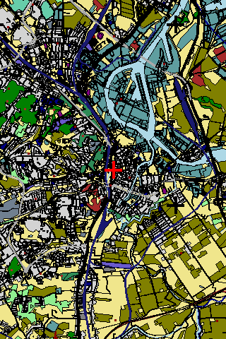
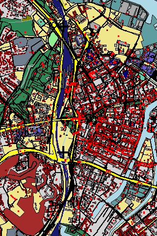
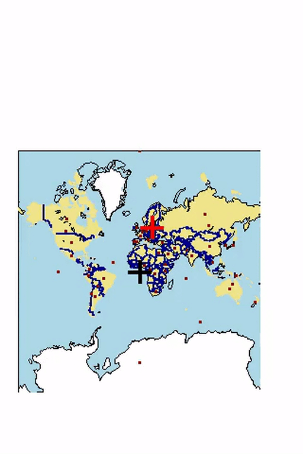
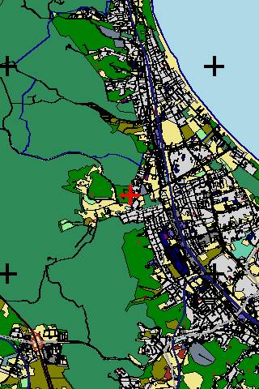
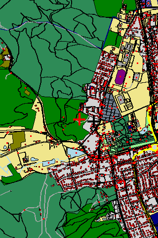

# Decoding and rendering MBTiles files using Python

Python scripts for experimenting with `MBTiles` files.
Mostly to see how complex rendering is and how feasible
it would be to implement this on a embedded processor.

In the below images zoom levels 1-14 are supported by the `MBTiles` file.
Zoom levels 15-18 done just by scaling the vector image.

# TODO

 - the way the polygons are encoded ([link](https://docs.mapbox.com/vector-tiles/specification/#winding-order))
   makes them slow to draw in `PIL` (drawing on separete canvas and pasting)
 - there is no 'smart' detection of objects out of frame, so drawing with
   big tile sizes is slow

